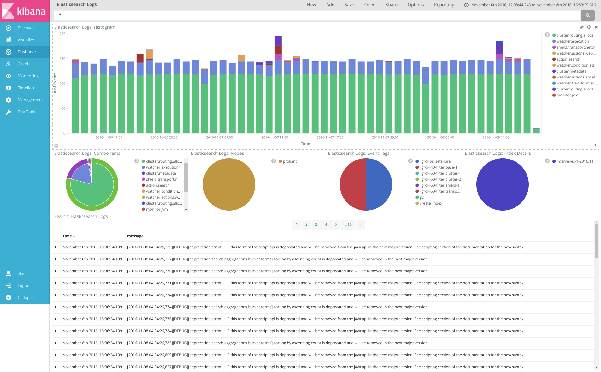

## What is this?

This is a way to visualise Elasticsearch logs (not slow logs) in
Kibana.  See the following screenshot for what it looks like:



## Installation

### Requirements

* Elasticsearch 2.1.x or higher
* Kibana 4.3.x or higher
* Logstash 2.1.x or higher

### Setup

#### 1. Load Elasticsearch mapping template

Load the Elasticsearch mapping template in
`elasticsearch/elasticsearch-template.json`:

```
curl -XPUT <eshost>:<esport>/_template/es-logs -d @elasticsearch/elasticsearch-template.json
```

Replace `<eshost>` and `<esport>` to your Elasticsearch ip/host and
port combo.

#### 2. Import Kibana dashboard/visualisations

Import the Kibana dashboard/visualisations in `kibana/export.json`

## Usage

### Helper Script

There is a helper script called `run.sh` in the root of this repo that
can assist with performing one-off indexing of logs via Logstash and
Elasticsearch.

Usage is simple:

```sh
./run.sh -h https://myes.com:9200 -u user -p password path/to/logs
```

Where:

* `-h` is the URL (including the port) for your Elasticsearch endpoint
* `-u` and `-p` are the username and password to access your
  Elasticsearch endpoint (optional).

The remaining command-line arguments are treated as log files.
Standard shell wildcard/globbing applies.

If you add a `-t` option the script will load the Elasticsearch
template shipped in this repo into Elasticsearch for you before
performing any indexing with Logstash.

### Manual Indexing

Create an *output* configuration in the `logsash/conf.d` directory
appropriate for your Elasticsearch server. Ensure the index pattern is
`elasticsearch-logs-5-%{YYYY.MM.DD}`. Then simply pipe your log files to logstash using this configuration file:

```
/path/to/bin/logstash --config logstash/conf.d < /path/to/elasticsearch.log
# or
cat /path/to/logs/*.log | /path/to/bin/logstash --config logstash
```

## Contributing

Most of the time you'll probably want to add new Logstash filters to
parse various components not already handled here.  You may also need
to update the dynamic template mapping used by the index if you add
new fields or import/export a new dashboard/visualisation from/to Kibana.

### Elasticsearch

The mapping file is located in the [elasticsearch](elasticsearch) directory in the file `elasticsearch-template.json`.  After editing, you'll
need to update the mapping in your Elasticsearch cluster with the curl
command above and reindex any log files.

### Logstash

All of the filters for a base component of logging in Elasticsearch
go into a seperate `logstash/conf.d/50-filter-<component>.conf` Logstash configuration file. So
for example, filters for **index.shard** and **index.fielddata** log
messages go into a `50-filter-index.conf` Logstash configuration file.

The following standard input, filter and output configuration files
also exist:

* `10-input-stdin.conf`: for reading stdin.
* `40-filter-base.conf`: base filter configuration to parse timestamp,
log level and component.
* `45-filter-exceptions.conf`: parses multiline java stack traces.
* `90-output-dots.conf`: outputs a `.` to the console for each log
line processed.

### Kibana

The dashboards and visualisations shown in the screenshot are in the
[kibana](kibana) directory in the `export.json` file.
